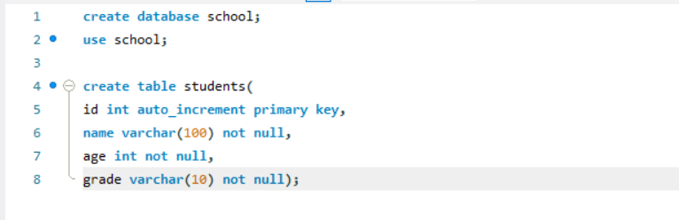

### CRUD Operations with MySQL and FastAPI

### step 1.
#### Setting up MySQL server

1. Created a local Instance in MySQL workbench and created a databse school
2. Created a Table students with columns id, name , age , grade.

### step 2.
#### created a database.py file
2. 