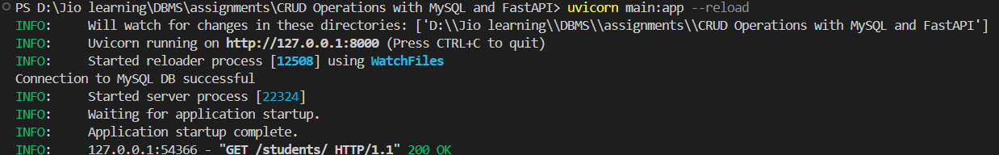
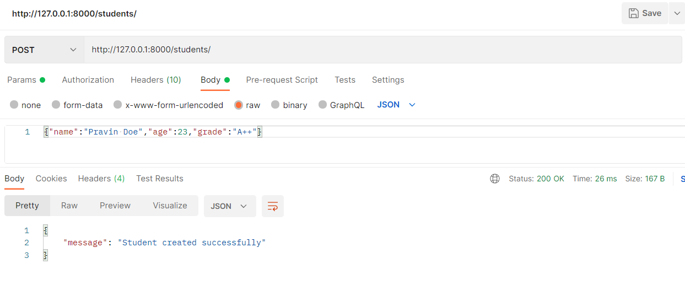
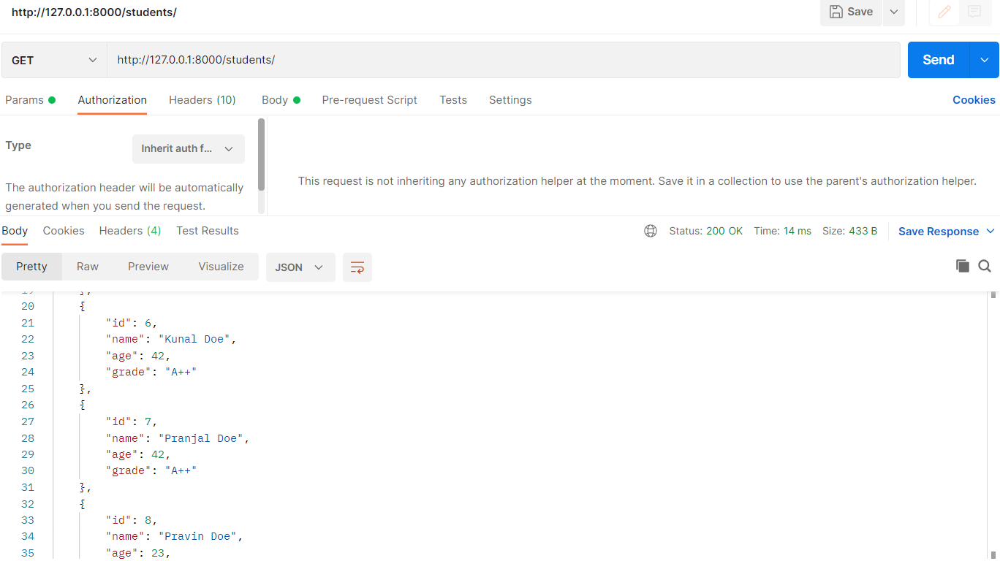
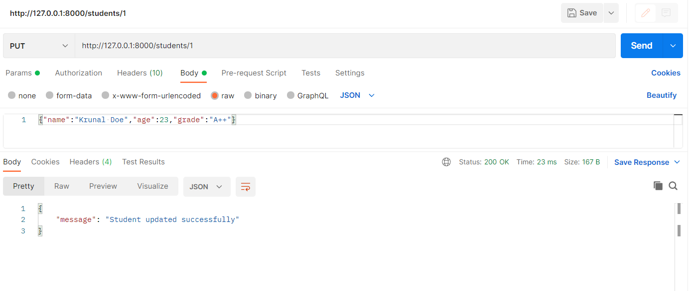
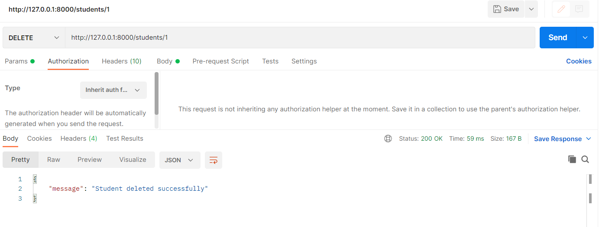
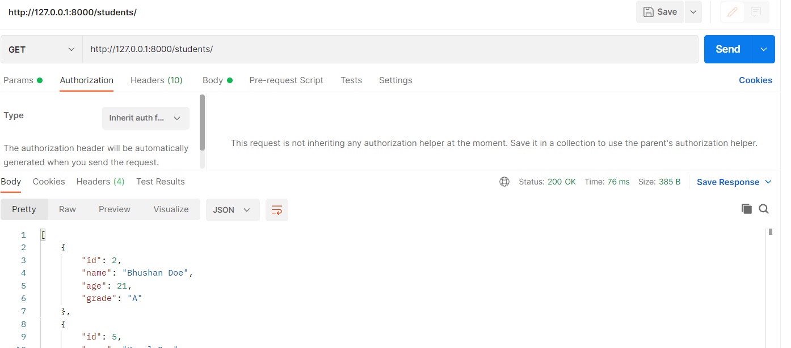
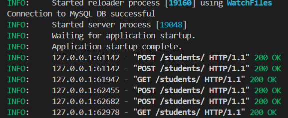

## Assignment 5 & 6

### Group members:
#### Pravin Patrike 
#### Kunal Deshmukh 
#### Shikha Thakur 
#### Krunal Name
#### Pranjal Grover 

### assignment 6 video link -
[ Video Link ](https://1drv.ms/v/c/af59b0c845464bc4/Ee_aPF1PbjNLuloyM-IUPzwBa1_LCTWhaGmM0GA2Gv-kKA?e=Om5GiE)

### assignment 5 -

### CRUD Operations with MySQL and FastAPI

### step 1.
#### Setting up MySQL server

1. Created a local Instance in MySQL workbench and created a databse school
2. Created a Table students with columns id, name , age , grade.


### step 2.
####  Implement CRUD Wrapper Functions
1. Install mysql-connector-python:
``` pip install mysql-connector-python ```
2. created a database.py module

Create a Python module database.py to implement the database connection and
CRUD operations.

### Step 3
#### Develop RESTful APIs with FastAPI
1. Install FastAPI and Uvicorn:
    ``` pip install fastapi uvicorn ```
2. Created FastAPI Application: Created a file named main.py

3. Run the FastAPI Application:
uvicorn main:app --reload


#### Part 4: Test the Application
```

Create a Student:
curl -X POST "http://127.0.0.1:8000/students/" -H "accept:
application/json" -H "Content-Type: application/json" -d
'{"name":"John Doe","age":21,"grade":"A"}'
Get All Students:
curl -X GET "http://127.0.0.1:8000/students/" -H "accept:
application/json"

Get a Student by ID:
curl -X GET "http://127.0.0.1:8000/students/1" -H "accept:
application/json"

Update a Student:
curl -X PUT "http://127.0.0.1:8000/students/1" -H "accept:
application/json" -H "Content-Type: application/json" -d
'{"name":"Jane Doe","age":22,"grade":"A+"}'

Delete a Student:
curl -X DELETE "http://127.0.0.1:8000/students/1" -H "accept:
application/json"

```
Screenshots -
Post (Create) -


Get (Read)-


Update -


Delete -


delete successful-

---



.
